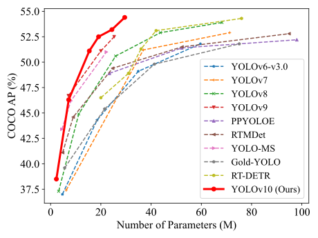

# FRC 2024 Game Piece Detection


Uses the PyTorch implementation of **YOLOv10** before converting it to RKNN (RK3588) format for use in PhotonVision.

<p align="center">
  
   <br>
  Comparisons with others in terms of latency-accuracy (left) and size-accuracy (right) trade-offs.
</p>

<details>
  <summary>
  <font size="+1">Original Paper</font>
  </summary>
  <a href="https://arxiv.org/abs/2405.14458">YOLOv10: Real-Time End-to-End Object Detection</a>.<br>
  Ao Wang, Hui Chen, Lihao Liu, Kai Chen, Zijia Lin, Jungong Han, and Guiguang Ding
</details>

&nbsp;

<details>
  <summary>
  <font size="+1">Abstract</font>
  </summary>
  In the realm of real-time object detection for FRC (FIRST Robotics Competition) robotics, the latest advancements in YOLO (You Only Look Once) models have shown significant improvements. YOLOv10, the latest iteration, offers substantial benefits over its predecessors like YOLOv8, particularly in game piece detection.

  Over the years, YOLO models have been widely used for their balance between computational cost and detection performance. Researchers have enhanced these models through architectural innovations, optimization techniques, and data augmentation strategies. Despite these advancements, previous YOLO models, including YOLOv8, have faced limitations due to their reliance on non-maximum suppression (NMS) for post-processing, which affects inference latency and deployment efficiency. Additionally, the design of various components in these models has not been thoroughly optimized, resulting in computational redundancy and suboptimal efficiency.

  YOLOv10 addresses these issues by introducing several key improvements:

  <ol>
  <li>
  NMS-Free Training: YOLOv10 incorporates consistent dual assignments for NMS-free training, which eliminates the need for traditional NMS post-processing. This change significantly reduces inference latency, making the model more suitable for real-time applications like game piece detection in FRC robotics.
  </li>

  <li>
  Holistic Efficiency-Accuracy Design: The architecture of YOLOv10 is optimized for both efficiency and accuracy. This comprehensive redesign minimizes computational overhead while enhancing model capability, resulting in faster and more accurate detection.
  </li>

  <li>
  Performance and Efficiency: Extensive experiments demonstrate that YOLOv10 outperforms previous versions across various metrics. For instance, YOLOv10-S is 1.8 times faster than RT-DETR-R18 with similar accuracy on the COCO dataset, while using 2.8 times fewer parameters and FLOPs. Compared to YOLOv9-C, YOLOv10-B achieves a 46% reduction in latency and a 25% decrease in parameters without sacrificing performance.
  </li>
  </ol>

  In the context of FRC robotics, these improvements mean that YOLOv10 can detect game pieces more quickly and accurately, with lower computational requirements. This makes it an ideal choice for real-time applications where both speed and precision are critical. By leveraging YOLOv10, FRC teams can enhance their robots' ability to detect and interact with game pieces, ultimately improving their performance in competitions.
</details>

## Models
Trained on Team 4169's Dataset Colab dataset.

| Model | Test Size | Precision | Recall | mAP50 | mAP50-95 | Latency (ms) |
|:---------------|:----:|:---:|:--:|:--:|:--:|:--:|
| [Epoch 130 Best PyTorch](https://huggingface.co/jameslahm/yolov10n) |   640  |     0.962    |   0.964   |     0.981     | 0.848 | 1.2ms |
| [YOLOv10-N ONNX 12](https://huggingface.co/jameslahm/yolov10n) |   640  |     0.962    |   0.964   |     0.981     | 0.848 | ? |
| [YOLOv10-N ONNX 13](https://huggingface.co/jameslahm/yolov10s) |   640  |     0.962    |   0.964  |     0.981     | 0.848 | ? |
| [YOLOv10-N ONNX 17](https://huggingface.co/jameslahm/yolov10m) |   640  |     0.962   |   0.964  |     0.981     | 0.848 | ? |
| [YOLOv10-N RKNN INT8](https://huggingface.co/jameslahm/yolov10b) |   640  |     ?   |  ? |     ?     | ? | ? |

## Installation
`conda` virtual environment is recommended. 
```
conda create -n yolov10 python=3.10
conda activate yolov10
pip install -r requirements.txt
pip install -e .
```

## Training 
[`yolov10n`](https://huggingface.co/jameslahm/yolov10n)  [`yolov10s`](https://huggingface.co/jameslahm/yolov10s)  [`yolov10m`](https://huggingface.co/jameslahm/yolov10m)  [`yolov10b`](https://huggingface.co/jameslahm/yolov10b)  [`yolov10l`](https://huggingface.co/jameslahm/yolov10l)  [`yolov10x`](https://huggingface.co/jameslahm/yolov10x)  
```
yolo task=detect \
     mode=train \
     epochs=250 \
     batch=96 \
     plots=True \
     model=pretrained/yolov10n.pt \
     data=data/data.yaml \
     device=0
```

Or

```python
from ultralytics import YOLOv10

model = YOLOv10()
# If you want to finetune the model with pretrained weights, you could load the 
# pretrained weights like below
# model = YOLOv10.from_pretrained('jameslahm/yolov10{n/s/m/b/l/x}')
# or
# wget https://github.com/THU-MIG/yolov10/releases/download/v1.1/yolov10{n/s/m/b/l/x}.pt
# model = YOLOv10('yolov10{n/s/m/b/l/x}.pt')

model.train(data='data/data.yaml', epochs=500, batch=256, imgsz=640)
```

Or

```
bash train.sh
```

## Validation
```
yolo val model=runs/detect/train/weights/best.pt data=data/data.yaml batch=96
```

Or

```python
from ultralytics import YOLOv10

model = YOLOv10('runs/detect/train/weights/best.pt')

model.val(data='data/data.yaml', batch=96)
```

Or

```
python3 val.py
```

## Prediction
Note that a smaller confidence threshold can be set to detect smaller objects or objects in the distance. Please refer to [here](https://github.com/THU-MIG/yolov10/issues/136) for details.
```
yolo predict model=runs/detect/train/weights/best.pt
```

Or

```python
from ultralytics import YOLOv10

model = YOLOv10('runs/detect/train/weights/best.pt')

model.predict()
```

## Export
```
# End-to-End ONNX
yolo export model=runs/detect/train/weights/best.pt format=onnx opset=13 simplify
# Predict with ONNX
yolo predict model=best.onnx
```

Or

```python
from ultralytics import YOLOv10

model = YOLOv10("runs/detect/train/weights/best.pt")

model.export(format="onnx", opset=13)
```

## Convert to RKNN
Set up docker container.
```
docker pull kaylor/rk3588_onnx2rknn:beta
docker run -it -v "/media/yolov10/:/root/ws" kaylor/rk3588_onnx2rknn:beta bash 
```
Perform the conversion.
```
cd /root/ws
python onnx_to_rknn.py best.onnx rk3588 i8 yolov10n_i8.rknn
exit
```